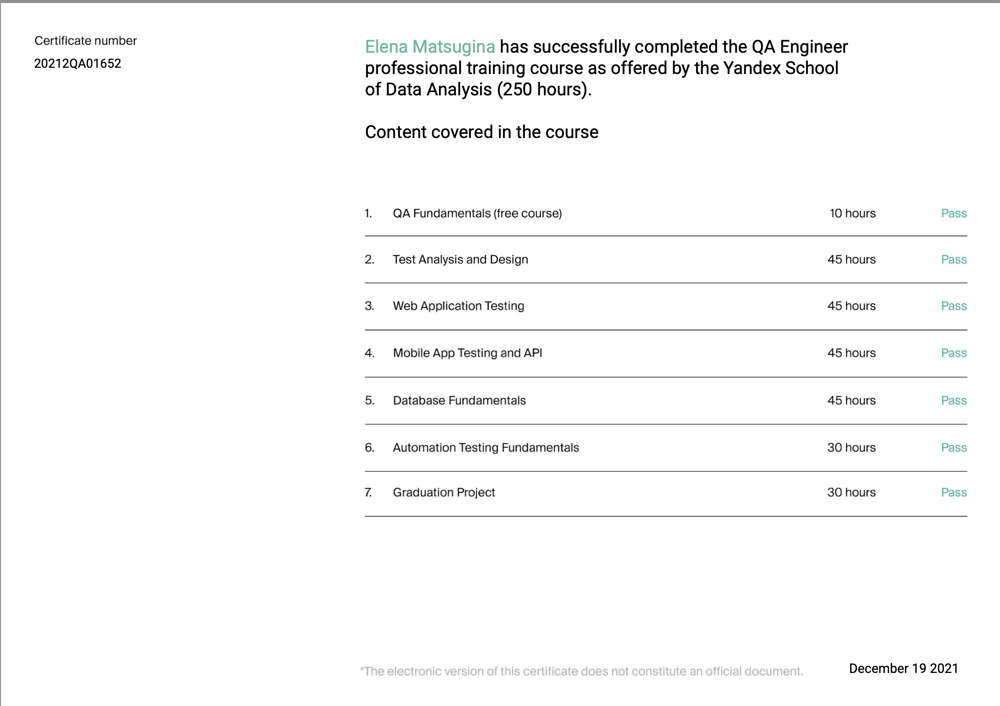
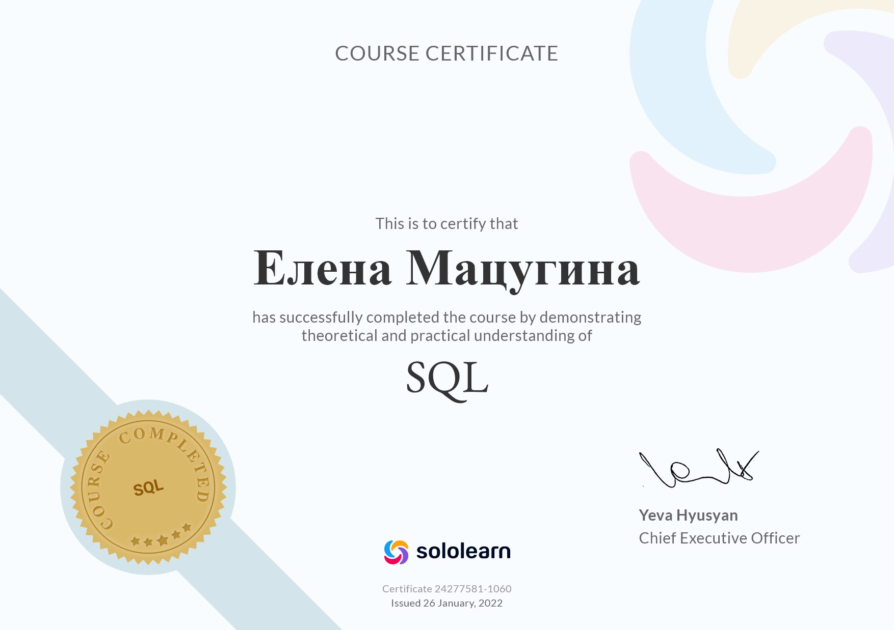
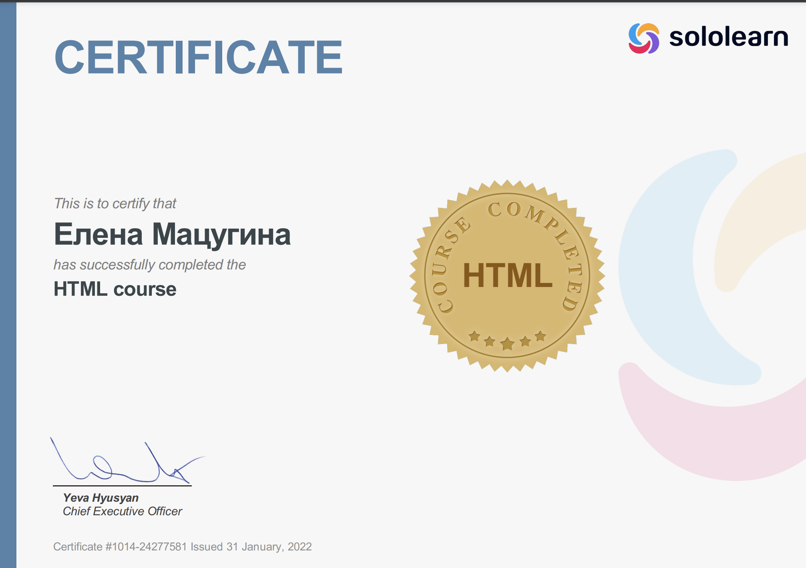
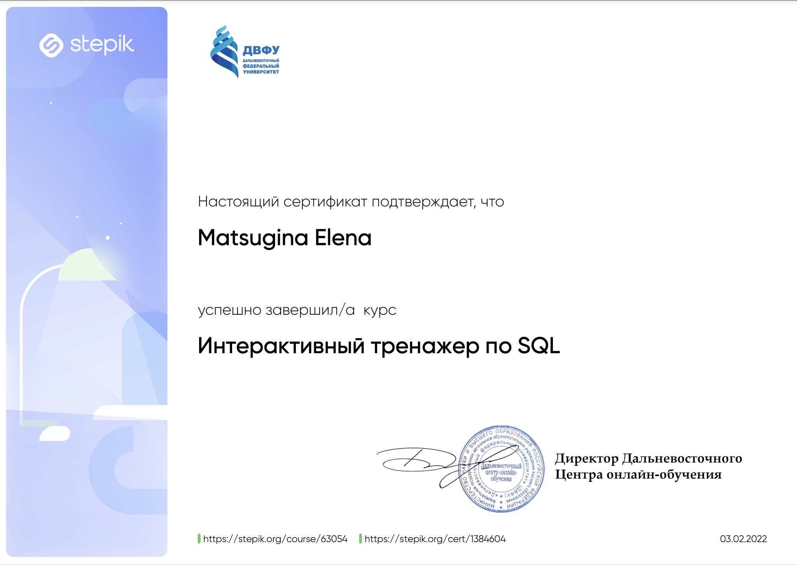

### Самообразование (сертификаты)

[Yandex.Practicum](#yandexpraktikum)

[Sololearn: SQL AND HTML](#sololearn-sql-and-html)

[STEPIK: SQL](#stepik-sql)

### Yandex.Praktikum

### Sololearn: SQL 

### Sololearn: HTML

### STEPIK: SQL
