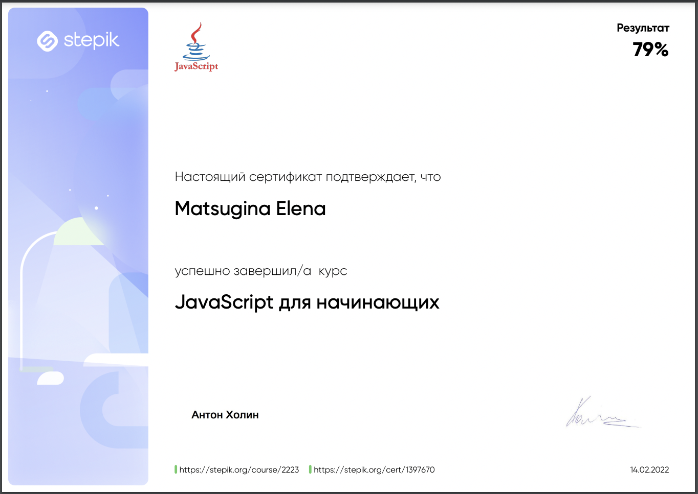

### Самообразование (сертификаты)

[Yandex.Practicum](#yandexpraktikum)

[Sololearn: SQL](#sololearn-sql)

[Sololearn: HTML](#sololearn-html)

[STEPIK: SQL](#stepik-sql)

[STEPIK: JS](#stepik-js)

### Yandex.Praktikum

### Sololearn: SQL 
                           [Оглавление](../projects/Certificates.md)

### Sololearn: HTML
                           [Оглавление](../projects/Certificates.md)

### STEPIK: SQL
  

### STEPIK: JS

[Оглавление](../projects/Certificates.md)