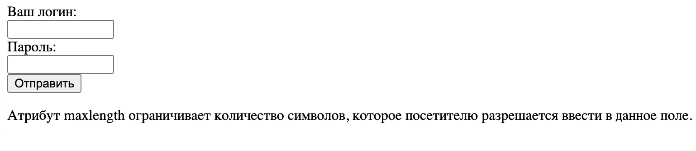

[Назад](../projects/ProjOne.md)

>  Примеры тестов на поля ввода




* [Ссылка на документацию](./Document.md)
* [Ссылка на чек лист](./check-lists.md)
* [Ссылка на чек-лист на валидацию полей](./MyValidation.md)

<br/>
_______________________________________________________________________________________________

```html
<!DOCTYPE html>
<html>
<head>
    <meta charset="UTF-8">
    <title>Ввод текста и пароля</title>
</head>
<body>
<form action="action_form.php" method="POST">
    Ваш логин:<br>
    <input type= "text" name="login" size="15" maxlength="30"> <br>
    Пароль:<br>
    <input type="password" name="password" size="15" maxlength="30"><br>
    <input type="submit">
</form>
<p>Атрибут maxlength ограничивает количество символов, которое посетителю разрешается ввести в данное поле.</p>
</body>
</html>
```


