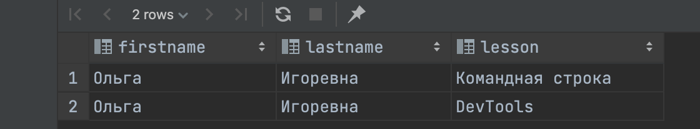

 > <a href ="https://github.com/MatsuginaElena/portfolio/blob/master/projects/RBD.md">Назад</a>

### Задачка 1

Вывести всех студентов.

>SELECT firstname, lastname FROM Students;

### Задачка 2

Вывести количество курсов для изучения. Результирующее поле sum_cur.

>SELECT COUNT(title) AS sum_cur FROM Courses;

### Задачка 3

Найти все уроки, которые относятся к курсу QA. Результирующее поле  result.

>SELECT cc.lesson AS result FROM course_content AS cc JOIN courses c ON c.id = cc.course_id WHERE c.title = 'QA';

### Задачка 4

Вывести студента под номером 4 и все курсы, которые он(а) проходит.

> SELECT s.firstname, s.lastname, cc.lesson FROM students s
JOIN course_student cs on s.id = cs.student_id
JOIN course_content cc on cs.course_id = cc.course_id
WHERE s.id = 4 AND cs.course_id = 6;
> 
> 